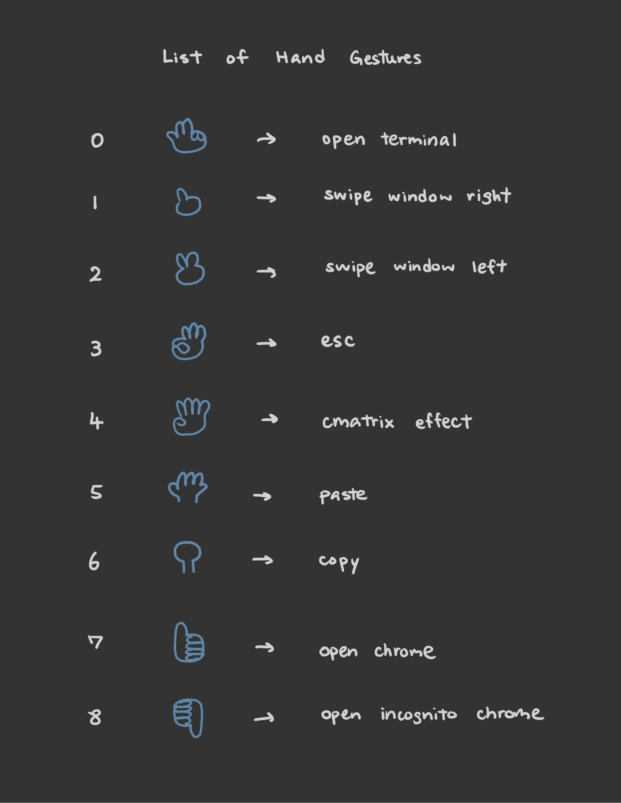

# Signal Project

This application allows the user to control their Linux desktop using different gestures!





## Installation

Run the commands below in the project root directory

```python
  pip install -r requirements.txt
  python3 app.py
```


